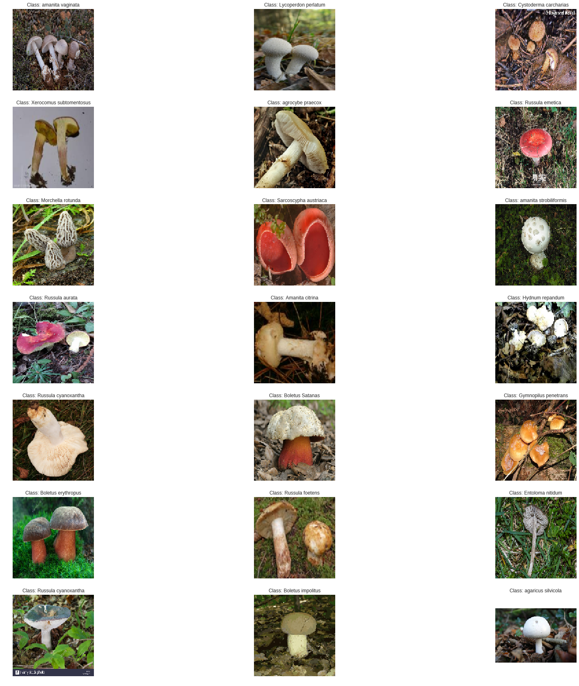
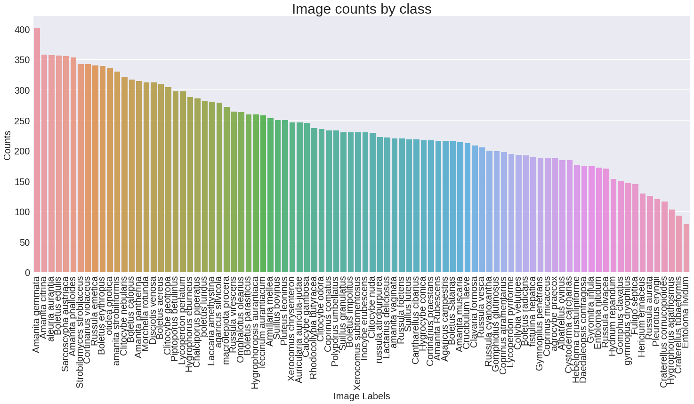
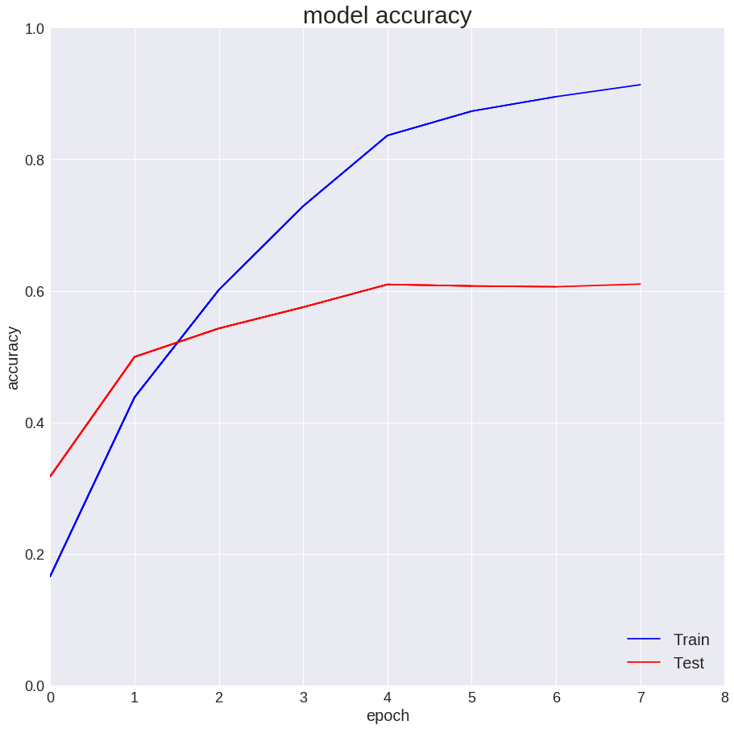
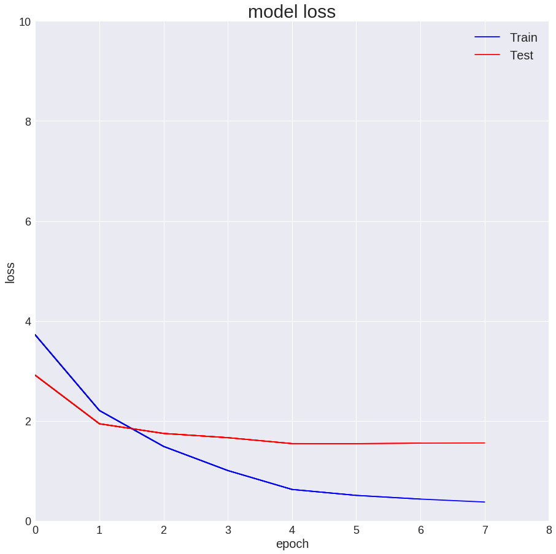
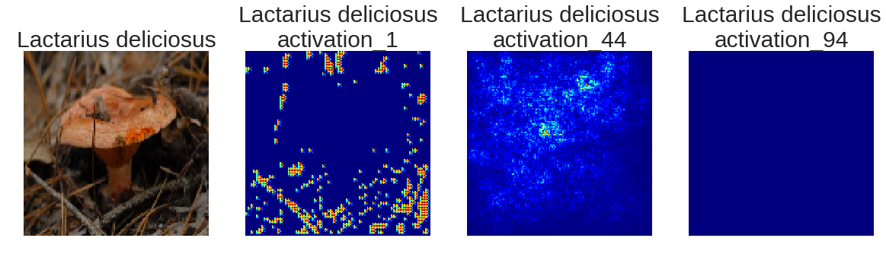
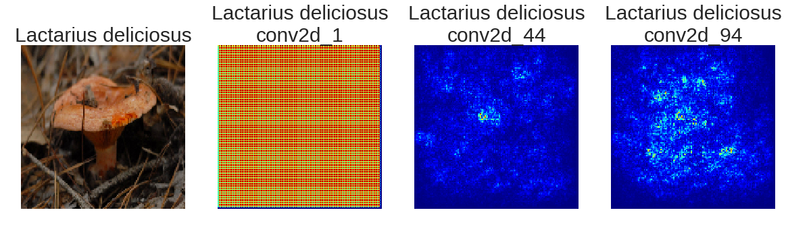
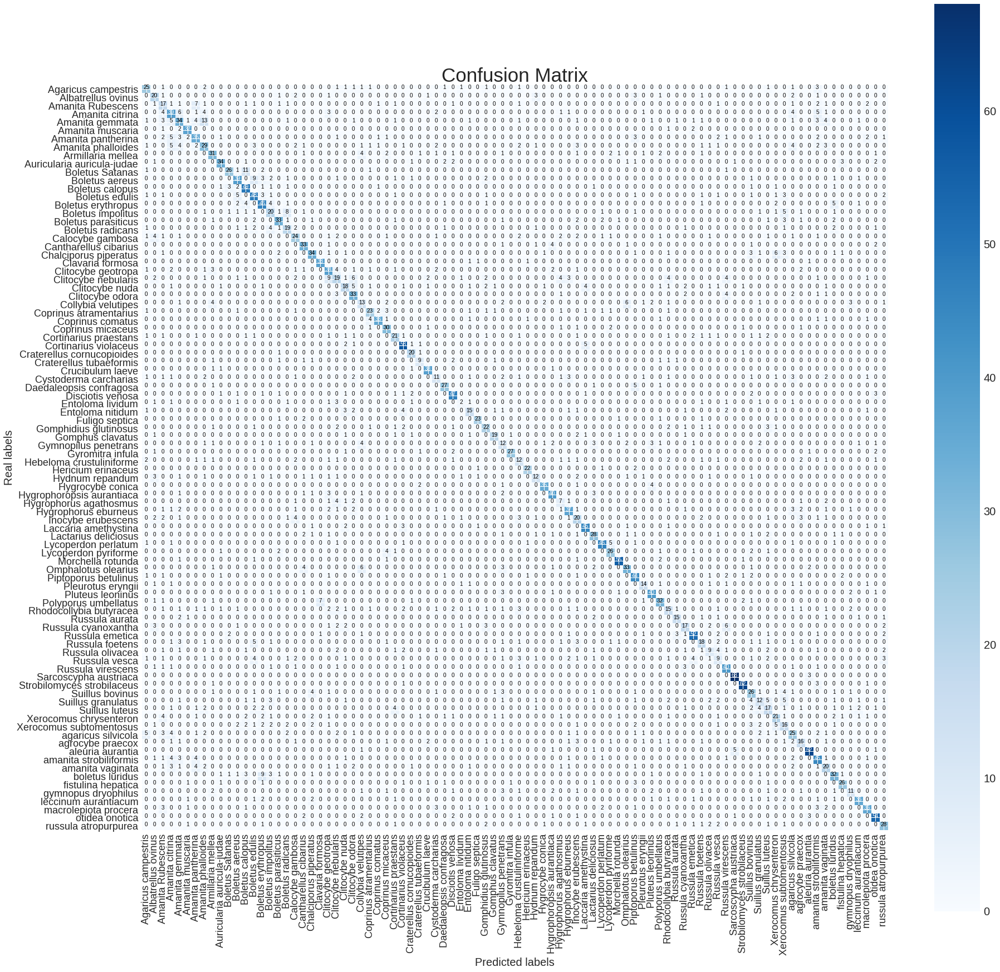
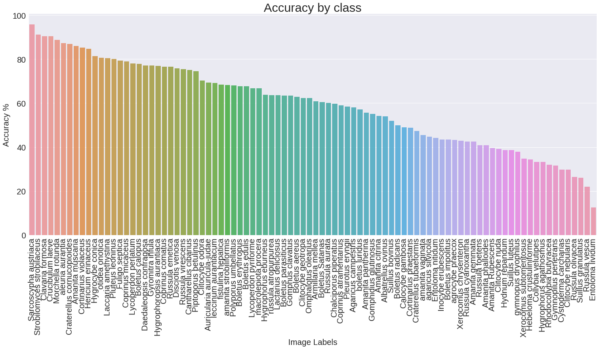
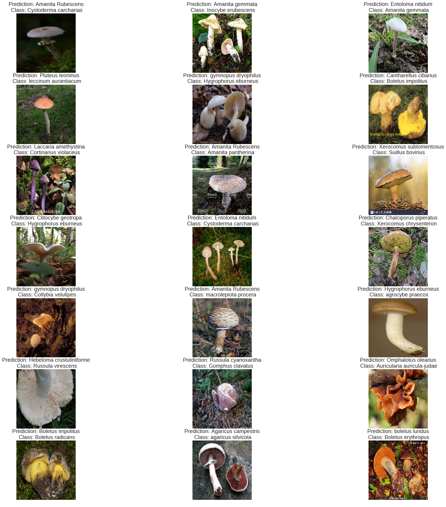

[View in Colaboratory](https://colab.research.google.com/github/nifred/Champypy/blob/master/Keras_champypy_inceptionV3.ipynb)

# Champypy CNN Training script

## Making train, validation and test sets

Using pandas and sklearn model selection train test split.


```python
import keras
```

    Using TensorFlow backend.


Mount a google drive with the dataset in pickle format on


```python
from google.colab import drive
drive.mount('/gdrive')
```

```python
import pandas as pd
from sklearn.model_selection import train_test_split
```

Reading the dataset.


```python
dataset = pd.read_pickle('/gdrive/My Drive/dataSet_x500.data')

```

Splitting features and target in two data sets.


```python
target = dataset.loc[:,'classes']
dataset.drop('classes', axis=1, inplace=True)
```

Train set 72 % of the dataset.

Validation set 8% of the dataset.

Test set 20 % of the dataset.


```python
X_train, X_test, y_train, y_test = train_test_split(dataset, target, test_size=0.20, stratify=target)
X_train, X_val, y_train, y_val = train_test_split(X_train, y_train, test_size=0.10, stratify=y_train)
```

### Showing random pictures


```python
from matplotlib import cm
j=0
plt.figure(figsize=(30,30))
for i in np.random.choice(len(dataset), size=21) :
    j=j+1
    img = np.asarray(dataset.iloc[i,:])
    img = img.reshape(140,140,3)
    
    plt.subplot(7,3,j)
    plt.axis('off')
    plt.imshow(img,cmap = cm.binary)
    plt.title('Class: {}'.format(target[i], fontsize=18))
```





### Distribution of mushroom classes


```python
import seaborn as sns
import matplotlib.pyplot as plt
%matplotlib inline
label_counts = target.value_counts()
plt.figure(figsize = (25,10))
sns.barplot(label_counts.index, label_counts.values, alpha = 0.9)
plt.xticks(rotation = 'vertical')
plt.xlabel('Image Labels', fontsize =20)
plt.ylabel('Counts', fontsize = 20)
plt.title('Image counts by class', fontsize=30)
plt.tick_params(axis = 'both', which = 'major', labelsize = 20)
plt.show();
```

    /usr/local/lib/python3.6/dist-packages/seaborn/categorical.py:1428: FutureWarning: remove_na is deprecated and is a private function. Do not use.
      stat_data = remove_na(group_data)





## Transforming train, validation, test sets for model training


```python
import numpy as np
```

Transforming data sets in numpy arrays


```python
X_train = np.asarray(X_train)
X_test = np.asarray(X_test)
X_val = np.asarray(X_val)
```

Reshaping data sets in a series of pictures of from 58800px to 140x140x3


```python
X_train = X_train.reshape(X_train.shape[0], 140, 140, 3)
X_test = X_test.reshape(X_test.shape[0], 140, 140, 3)
X_val = X_val.reshape(X_val.shape[0], 140, 140, 3)
```

Encoding string labels to integer labels


```python
from sklearn.preprocessing import LabelEncoder
```


```python
encoder = LabelEncoder()
y_train = encoder.fit_transform(np.asarray(y_train))
y_test = encoder.transform(np.asarray(y_test))
y_val = encoder.transform(np.asarray(y_val))
```

One hot encoding the integer labels


```python
from keras.utils import to_categorical
y_train = to_categorical(y_train)
y_test = to_categorical(y_test)
y_val = to_categorical(y_val)
```

## CNN Model

Making an Image data generator to flow datas inside the model


```python
from keras.preprocessing.image import ImageDataGenerator
datagen = ImageDataGenerator(
    featurewise_center=False,
    featurewise_std_normalization=False,
    rescale=1./255,
    data_format="channels_last")
```

Fitting the image data generator to the train set


```python
datagen.fit(X_train)
```


```python
train_datagen = datagen.flow(X_train, y_train, batch_size=32)
val_datagen = datagen.flow(X_val, y_val, batch_size=32)
test_datagen = datagen.flow(X_test, y_test, batch_size=32)
```


```python
from keras.applications import InceptionV3
from keras.models import Model
from keras.layers import Dense, Input, Dropout, Flatten, AveragePooling2D
from keras.callbacks import ModelCheckpoint, CSVLogger, EarlyStopping, LearningRateScheduler
from keras.regularizers import l2
from keras.optimizers import SGD
import keras.backend as K
```

## Model

The base model is an InceptionV3 with ImageNet weights retrained with our dataset.
The last layers is made of an:


*  AveragePooling2D layer with a pool size of 3x3 to reduce the number of parameters
*  Dropout layer of 0.4 for preventing complex co-adaptations on training data.
*  Flatten layer to reshape the matrix
*  Dense layer of 90 classes with a [glorot uniform initializer](http://jmlr.org/proceedings/papers/v9/glorot10a/glorot10a.pdf),  an l2 of 0.05 biais regulizer to solve overfitting problem and a softmax activation

We are logging each epoch, and saving best weights on the Google drive.
Also we are using a learning rate scheduler to increase performance and avoid overfitting and an early stopping.


```python
K.clear_session()


base_model = InceptionV3(
    weights='imagenet',
    include_top=False,
    input_tensor=Input(
        shape=(140, 140, 3)
    )
)


x = base_model.output
x = AveragePooling2D(pool_size=(3, 3))(x)
x = Dropout(.4)(x)
x = Flatten()(x)

predictions = Dense(
    90,
    kernel_initializer='glorot_uniform',
    bias_regularizer=l2(.05),
    activation='softmax')(x)

model = Model(
    inputs=base_model.input,
    outputs=predictions
)


opt = SGD(lr=.01, momentum=.9)
model.compile(
    optimizer=opt,
    loss='categorical_crossentropy',
    metrics=['accuracy']
)

checkpointer = ModelCheckpoint(
    filepath='/gdrive/My Drive/Champypy_InceptionV3.1.{epoch:02d}-{val_loss:.2f}.hdf5',
    monitor='val_loss',
    verbose=1,
    save_best_only=True
)
csv_logger = CSVLogger(
    '/gdrive/My Drive/Champypy_InceptionV3.1.log'
)


def schedule(epoch):
    if epoch < 4:
        return .001
    elif epoch < 10:
        return .0002
    else:
        return .00004
      
lr_scheduler = LearningRateScheduler(schedule)
early_stopping = EarlyStopping(monitor='val_loss',
                              min_delta=0,
                              patience=2,
                              verbose=0, mode='auto')
model.fit_generator(
    train_datagen,
    validation_data=val_datagen,
    steps_per_epoch=len(X_train) / 32,
    epochs=32,
    verbose=1,
    callbacks=[
        csv_logger,
        checkpointer,
        lr_scheduler,
        early_stopping
    ]
)


```

    Epoch 1/32
    480/479 [==============================] - 195s 407ms/step - loss: 3.7214 - acc: 0.1659 - val_loss: 2.9132 - val_acc: 0.3177
    
    Epoch 00001: val_loss improved from inf to 2.91318, saving model to /gdrive/My Drive/Champypy_InceptionV3.1.01-2.91.hdf5
    Epoch 2/32
    480/479 [==============================] - 184s 383ms/step - loss: 2.2076 - acc: 0.4378 - val_loss: 1.9415 - val_acc: 0.4994
    
    Epoch 00002: val_loss improved from 2.91318 to 1.94150, saving model to /gdrive/My Drive/Champypy_InceptionV3.1.02-1.94.hdf5
    Epoch 3/32
    480/479 [==============================] - 185s 385ms/step - loss: 1.4881 - acc: 0.6014 - val_loss: 1.7480 - val_acc: 0.5428
    
    Epoch 00003: val_loss improved from 1.94150 to 1.74801, saving model to /gdrive/My Drive/Champypy_InceptionV3.1.03-1.75.hdf5
    Epoch 4/32
    480/479 [==============================] - 184s 384ms/step - loss: 1.0061 - acc: 0.7285 - val_loss: 1.6633 - val_acc: 0.5750
    
    Epoch 00004: val_loss improved from 1.74801 to 1.66334, saving model to /gdrive/My Drive/Champypy_InceptionV3.1.04-1.66.hdf5
    Epoch 5/32
    480/479 [==============================] - 180s 374ms/step - loss: 0.6277 - acc: 0.8360 - val_loss: 1.5447 - val_acc: 0.6096
    
    Epoch 00005: val_loss improved from 1.66334 to 1.54465, saving model to /gdrive/My Drive/Champypy_InceptionV3.1.05-1.54.hdf5
    Epoch 6/32
    480/479 [==============================] - 180s 375ms/step - loss: 0.5083 - acc: 0.8732 - val_loss: 1.5435 - val_acc: 0.6073
    
    Epoch 00006: val_loss improved from 1.54465 to 1.54353, saving model to /gdrive/My Drive/Champypy_InceptionV3.1.06-1.54.hdf5
    Epoch 7/32
    480/479 [==============================] - 180s 374ms/step - loss: 0.4345 - acc: 0.8951 - val_loss: 1.5539 - val_acc: 0.6061
    
    Epoch 00007: val_loss did not improve from 1.54353
    Epoch 8/32
    480/479 [==============================] - 182s 379ms/step - loss: 0.3754 - acc: 0.9133 - val_loss: 1.5573 - val_acc: 0.6102
    
    Epoch 00008: val_loss did not improve from 1.54353


    <keras.callbacks.History at 0x7f76f08d7c18>


## Model train visualization

### Accuracy vs epoch


```python
import time
import pylab as plt
from IPython import display

acc= model.history.history['acc']
val_acc= model.history.history['val_acc']

first_iteration = True 
plt.figure(figsize=(15,15))
for i in range(8):
    train_acc, = plt.plot(acc[:i+1], label='Train', color='blue')
    test_acc, = plt.plot(val_acc[:i+1], label='Test', color='red')
    
    if first_iteration :
        plt.axis([0,8,0.0,1.0])
        plt.title('model accuracy', fontsize=30)
        plt.ylabel('accuracy', fontsize=20)
        plt.xlabel('epoch', fontsize=20)
        plt.legend(handles=[train_acc, test_acc], loc=4, fontsize=20)
        plt.tick_params(axis = 'both', which = 'major', labelsize = 18)
        first_iteration = False
        
    display.clear_output(wait=True)
    display.display(plt.gcf())
    
    time.sleep(1.5)

display.clear_output()
```





### Cross entropy vs epoch


```python
loss = model.history.history['loss']
val_loss = model.history.history['val_loss']

first_iteration = True 
plt.figure(figsize=(15,15))

for i in range(8):
    train_loss, = plt.plot(loss[:i+1], label= 'Train', color='blue')
    test_loss, = plt.plot(val_loss[:i+1], label= 'Test', color='red')
    
    if first_iteration:
        plt.axis([0,8,0,10])
        plt.title('model loss', fontsize=30)
        plt.ylabel('loss', fontsize=20)
        plt.xlabel('epoch', fontsize=20)
        plt.legend(handles=[train_loss, test_loss], loc='best', fontsize=20)
        plt.tick_params(axis = 'both', which = 'major', labelsize = 18)
        first_iteration = False
    
    display.clear_output(wait=True)
    display.display(plt.gcf())

    time.sleep(1.0)

display.clear_output()
```





## Visualizing layer outputs

We are using the keras-vis librairy where you can found here: https://github.com/raghakot/keras-vis


```python
!pip install keras-vis
```


```python
from vis.losses import ActivationMaximization
from vis.regularizers import TotalVariation, LPNorm
from vis.input_modifiers import Jitter
from vis.callbacks import GifGenerator
```

Making a dictionary of model layers.


```python
layer_dict = dict([(layer.name, layer) for layer in model.layers])
```

Showing 3 activation layer outputs from begining, middle and last.


```python
from vis.visualization import visualize_saliency, overlay
from vis.utils import utils
from keras import activations
import matplotlib.pyplot as plt
%matplotlib inline

def showing_layer_outputs(layer_input):
  layers = []
  for layer in layer_dict.keys():
    if layer.__contains__(layer_input):
      layers.append(layer)
    
  layer_idx = [utils.find_layer_idx(model, e) for e in sorted(layers)]
  middle = int(round(len(layers)/2))
  layer_selected = [layer_idx[0], layer_idx[middle], layer_idx[-1]]
  img1 = X_train[0]
  f, ax = plt.subplots(1, 4, figsize=(20,10))
  ax0_text = encoder.inverse_transform(np.argmax(y_train[0], axis=-1))
  ax[0].set_title(ax0_text, fontsize=30)
  ax[0].grid('off')
  ax[0].axis('off')
  ax[0].imshow(img1)
  i=1
  n = [0, middle, len(layer_idx)-1]
  j=0
  for layer in layer_selected:
    grads = visualize_saliency(model, layer, filter_indices=0, seed_input=img1)
    ax[i].set_title(ax0_text + "\n" + layers[n[j]], fontsize=30)
    ax[i].grid('off')
    ax[i].axis('off')
    ax[i].imshow(grads, cmap='jet')
    i +=1
    j +=1

showing_layer_outputs('activation')
```

    /usr/local/lib/python3.6/dist-packages/sklearn/preprocessing/label.py:151: DeprecationWarning: The truth value of an empty array is ambiguous. Returning False, but in future this will result in an error. Use `array.size > 0` to check that an array is not empty.
      if diff:





Showing 3 conv2d layer outputs from begining, middle and last.


```python
showing_layer_outputs('conv2d')
```

    /usr/local/lib/python3.6/dist-packages/sklearn/preprocessing/label.py:151: DeprecationWarning: The truth value of an empty array is ambiguous. Returning False, but in future this will result in an error. Use `array.size > 0` to check that an array is not empty.
      if diff:





## Evaluation on test image data generator set

We got a 61% of accuracy with a 1.53 loss.


```python
evaluation = model.evaluate_generator(test_datagen)
print(evaluation)
```

    [1.5269060269082018, 0.6113977485928705]


## Prediction on test set


```python
prediction = model.predict(X_test/255)

```


```python
prediction_argmax = np.argmax(prediction, axis=-1)
y_test_argmax = np.argmax(y_test, axis=-1)
```

Getting the original label names


```python
y_test_v = encoder.inverse_transform(y_test_argmax)
pred_v = encoder.inverse_transform(prediction_argmax)
```

    /usr/local/lib/python3.6/dist-packages/sklearn/preprocessing/label.py:151: DeprecationWarning: The truth value of an empty array is ambiguous. Returning False, but in future this will result in an error. Use `array.size > 0` to check that an array is not empty.
      if diff:
    /usr/local/lib/python3.6/dist-packages/sklearn/preprocessing/label.py:151: DeprecationWarning: The truth value of an empty array is ambiguous. Returning False, but in future this will result in an error. Use `array.size > 0` to check that an array is not empty.
      if diff:


### Visualizing confusion matrix


```python
from sklearn.metrics import confusion_matrix
import itertools


def cf(y_test, prediction):
    cnf_matrix = confusion_matrix(y_test, prediction)
    classes= np.unique(y_test)

    plt.figure(figsize=(30,30))

    plt.imshow(cnf_matrix, interpolation='nearest',cmap='Blues')
    plt.title("Confusion Matrix", fontsize=35)
    cb = plt.colorbar()
    cb.ax.tick_params(labelsize=20)
    tick_marks = np.arange(len(classes))
    plt.xticks(tick_marks, classes)
    plt.yticks(tick_marks, classes)
    for i, j in itertools.product(range(cnf_matrix.shape[0]),
                                  range(cnf_matrix.shape[1])):
        plt.text(j, i, cnf_matrix[i, j],
                 horizontalalignment="center",
                 color="white" if cnf_matrix[i, j] > ( cnf_matrix.max() / 2) else "black")
    plt.ylabel('Real labels', fontsize=20)
    plt.xlabel('Predicted labels', fontsize=20)
    plt.xticks(rotation=90)

    plt.tick_params(axis = 'both', which = 'major', labelsize = 18)
    plt.show();
    

cf(y_test_v, pred_v)

```





```python
crosstab = pd.crosstab(y_test_v, pred_v, rownames=['Classe réelles'], colnames=['Classe prédites'])
```

## Prediction by class


```python
list_prediction_class = np.diag(crosstab)/crosstab.sum(axis=1)
```


```python
list_prediction_class = list_prediction_class.sort_values(ascending=False)
```


```python
import matplotlib.pyplot as plt
import seaborn as sns

plt.figure(figsize = (25,10))
sns.barplot(list_prediction_class.index, list_prediction_class.values*100, alpha = 0.9)
plt.title('Accuracy by class', fontsize=30)
plt.xticks(rotation = 'vertical')
plt.xlabel('Image Labels', fontsize =20)
plt.ylabel('Accuracy %', fontsize = 20)
plt.tick_params(axis = 'both', which = 'major', labelsize = 20)
plt.show();
```

    /usr/local/lib/python3.6/dist-packages/seaborn/categorical.py:1428: FutureWarning: remove_na is deprecated and is a private function. Do not use.
      stat_data = remove_na(group_data)





## Missclassified mushrooms


```python
from matplotlib import cm
j=0
plt.figure(figsize=(30,30))
for i in np.random.choice(np.where(y_test_v!=pred_v)[0], size=21) :
    j=j+1
    img = X_test[i,:] 
    img = img.reshape(140,140,3)
    
    plt.subplot(7,3,j)
    plt.axis('off')
    plt.imshow(img,cmap = cm.binary)
    plt.title('Prediction: {predict}\n Class: {test}'.format(predict=pred_v[i], test=y_test_v[i]), fontsize=18)

```




